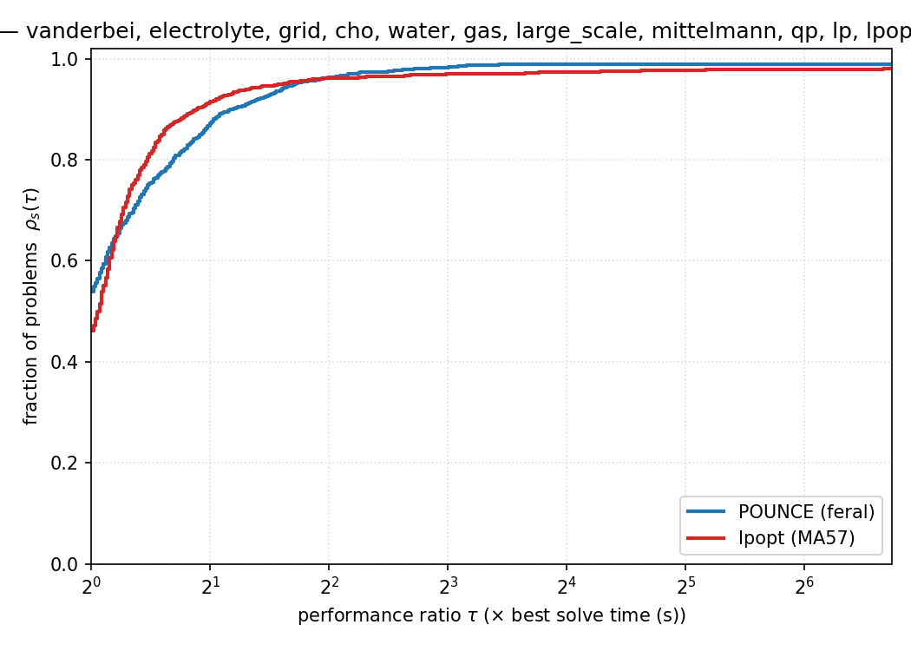
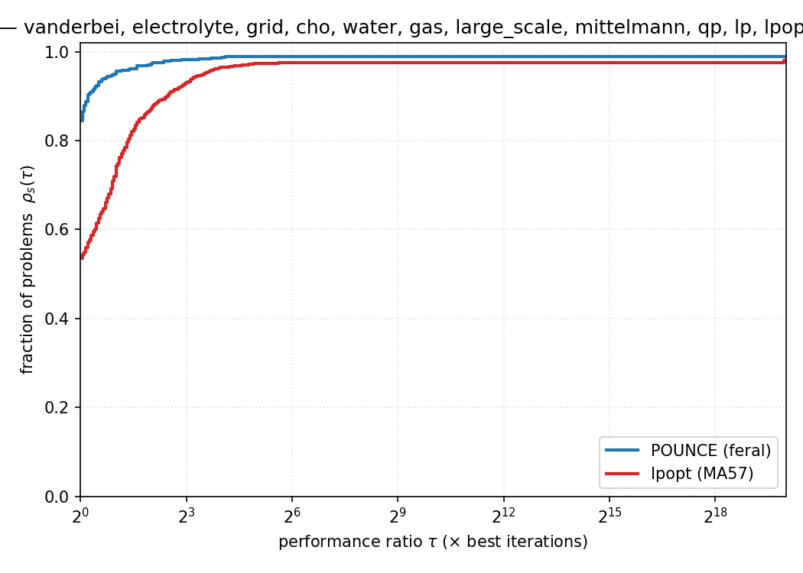
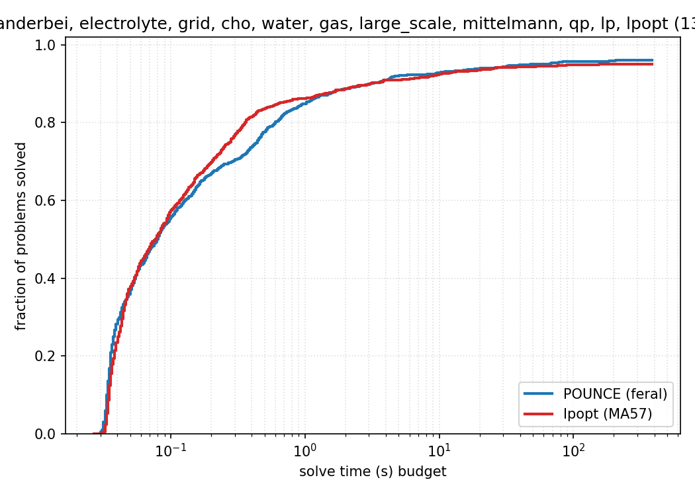

# POUNCE Benchmark Report

Generated: 2026-06-11 21:49:49

## Provenance

| Component | Version / Detail |
|-----------|------------------|
| POUNCE | v0.4.0 (main @ 659d98a-dirty) |
| POUNCE linear solver | feral (default) |
| Ipopt | Ipopt 3.14.20 (Darwin arm64), ASL(20241202) |
| Ipopt linear solver | ma57 (via ref/Ipopt/install-ma57) |
| Platform | Darwin 25.5.0 arm64 |

POUNCE results were produced this run by `make -C benchmarks
<suite>-run` (pounce only). The Ipopt column is a saved reference
(`make -C benchmarks ipopt-reference`), rerun only when explicitly
regenerated — generated 2026-06-11 21:49:49 EDT on Johns-Mac-mini.local (Darwin 25.5.0 arm64), git 659d98a, timelimit 300s. Ipopt solve *times* are
from that reference machine and only comparable to POUNCE when this
report is generated on the same host.

The GAMS solver-link path is exercised separately as a liveness
smoke check (`make -C benchmarks gams-bench`) and is not aggregated here.

> **Threading & timing.** The reference and POUNCE runs are pinned to a
> single compute thread (`OMP_NUM_THREADS`, `OPENBLAS_NUM_THREADS`,
> `VECLIB_MAXIMUM_THREADS`, `RAYON_NUM_THREADS` all = 1) and run
> sequentially so pounce and Ipopt solve times are directly comparable
> on one host.
> POUNCE's dense linear algebra (via `faer`/`rayon`) parallelizes across
> cores, so its *multi-threaded* wall-clock is up to ~2x faster on the
> larger dense problems (e.g. Mittelmann `cont*`/`qcqp*`, QP); the
> single-threaded times reported here are therefore a controlled lower
> bound, not pounce's real-world speed, and should not be compared
> against multi-threaded runs of this report.

## Executive Summary

| Metric | POUNCE | Ipopt |
|--------|--------|-------|
| Optimal (strict) | **1213/1326** (91.5%) | **1237/1326** (93.3%) |
| Acceptable (informational, *not* counted as solved) | 6 | 24 |
| Solved exclusively (strict Optimal) | 41 | 65 |
| Both Optimal | 1172 | |
| Matching objectives (< 0.01%) | 1133/1172 | |

> **Note:** All headline counts use strict Optimal status only. `Acceptable`
> means the iterate met relaxed tolerances but not the requested tolerance —
> per CLAUDE.md's "Honesty in Benchmarks" rule it is reported separately and
> never folded into the pass rate. See the "Acceptable (not Optimal)" and
> "Different Local Minima" sections below.

## Performance Profiles

[Dolan & Moré (2002)](https://doi.org/10.1007/s101070100263) performance profiles pooled over every suite with an Ipopt reference. ρ_s(τ) is the fraction of problems a solver solves within a factor τ of the fastest solver on each problem: the **height at τ=1** is how often it was the quickest, and the **right-hand plateau** is its overall robustness (fraction solved at all). A problem counts as solved only at strict/acceptable success; failures and timeouts are charged infinite cost. Regenerate or slice these with `python3 scripts/perf_profile.py <suite…> [--metric iters] [--mode data]`.

**Performance profile by wall-clock time.** Valid because POUNCE and Ipopt-MA57 were run interleaved on this host (see Provenance).
  
_1284 problems; solvers: pounce, ipopt._

**Performance profile by iteration count** — machine-independent, so it stays comparable across hosts and reruns.
  
_1284 problems; solvers: pounce, ipopt._

**Data profile (absolute-time ECDF).** Fraction of problems solved within a given wall-clock budget, without best-solver normalization — reads directly as “how many by 1 s? by 10 s?”.
  
_1326 problems; solvers: pounce, ipopt._

## Per-Suite Summary

| Suite | Problems | POUNCE Optimal | Ipopt Optimal | POUNCE only | Ipopt only | Both Optimal | Match |
|-------|----------|---------------|--------------|-------------|------------|--------------|-------|
| Vanderbei | 733 | 678 (92.5%) | 683 (93.2%) | 18 | 23 | 660 | 650/660 |
| Electrolyte | 13 | 13 (100.0%) | 13 (100.0%) | 0 | 0 | 13 | 13/13 |
| Grid | 4 | 4 (100.0%) | 4 (100.0%) | 0 | 0 | 4 | 4/4 |
| CHO | 1 | 1 (100.0%) | 1 (100.0%) | 0 | 0 | 1 | 1/1 |
| Water | 6 | 6 (100.0%) | 6 (100.0%) | 0 | 0 | 6 | 2/6 |
| Gas | 4 | 3 (75.0%) | 3 (75.0%) | 0 | 0 | 3 | 3/3 |
| LargeScale | 5 | 5 (100.0%) | 5 (100.0%) | 0 | 0 | 5 | 5/5 |
| Mittelmann | 47 | 43 (91.5%) | 37 (78.7%) | 6 | 0 | 37 | 36/37 |
| QP | 138 | 126 (91.3%) | 133 (96.4%) | 2 | 9 | 124 | 123/124 |
| LP | 371 | 333 (89.8%) | 352 (94.9%) | 14 | 33 | 319 | 296/319 |
| LPopt | 4 | 1 (25.0%) | 0 (0.0%) | 1 | 0 | 0 | 0/1 |

## Vanderbei Reference Cross-Check

Per-problem status from R. Vanderbei's `cute_table.pdf` (`vanderbei/cute_table_status.json`). The meaningful denominator is the **expected-solvable** set — problems with a documented finite optimum — not all 733: the CUTE collection deliberately includes unbounded, infeasible, and no-solver-finishes problems.

| cute_table status | problems | POUNCE solved | meaning |
|---|---|---|---|
| optimum | 684 | 643 | finite reference optimum exists (expected-solvable) |
| hard | 14 | 8 | in table, but SNOPT+NITRO+LOQO all hit time/iter limits |
| infeasible | 3 | 0 | a reference solver declared infeasibility |
| unbounded | 1 | 0 | unbounded below |
| untabulated | 31 | 27 | not in cute_table — no reference datum |

**POUNCE solved 643 / 684 expected-solvable (94.0%).** The hard / infeasible / unbounded / untabulated rows above are excluded from this denominator — a POUNCE failure there is shared with the commercial reference solvers and is not counted as a miss.

**Genuine misses — expected-solvable but POUNCE did not reach Optimal (41):**

> airport brainpc0 brainpc2 britgas coshfun cresc100 cresc132 cresc50 dallass deconvb eigena2 flosp2hh grouping himmelbj hs012 hs043 hs065 kissing liswet1 liswet10 liswet11 liswet12 liswet7 liswet8 liswet9 makela2 minmaxbd nonmsqrt orthrds2 orthrege palmer1c palmer5e palmer7c polak3 polak4 powell20 rosenmmx sawpath sineali steenbrc steenbrf

**Objective disagreements vs. cute_table reference (20)** — POUNCE converged but to a different value than the agreed reference optimum (possible wrong basin or misread problem):

| Problem | POUNCE obj | reference obj | rel. diff |
|---|---|---|---|
| quartc | 2.488823e+02 | 2.406057e-18 | 2.5e+02 |
| broydn7d | 3.450050e+02 | 3.823419e+00 | 8.9e+01 |
| dqrtic | 3.935818e+01 | 1.654558e-17 | 3.9e+01 |
| penalty1 | 6.439498e+00 | 9.686175e-03 | 6.4e+00 |
| eigenbco | 1.024905e-16 | 9.000000e+00 | 1.0e+00 |
| orthregd | 1.523900e+03 | 4.245801e+04 | 9.6e-01 |
| orthrgds | 1.523900e+03 | 2.603509e+04 | 9.4e-01 |
| bt4 | -3.704768e+00 | -4.551055e+01 | 9.2e-01 |
| camel6 | -2.154638e-01 | -1.031628e+00 | 7.9e-01 |
| fletcher | 1.165685e+01 | 1.952537e+01 | 4.0e-01 |
| discs | 1.444952e+01 | 1.200008e+01 | 2.0e-01 |
| hs044 | -1.300000e+01 | -1.500000e+01 | 1.3e-01 |
| avgasb | -4.483219e+00 | -4.132819e+00 | 8.5e-02 |
| steenbre | 2.851495e+04 | 2.745916e+04 | 3.8e-02 |
| haldmads | 3.195581e-02 | 1.223712e-04 | 3.2e-02 |
| errinros | 4.040449e+01 | 3.990415e+01 | 1.3e-02 |
| cliff | 2.072380e-01 | 1.997866e-01 | 7.5e-03 |
| lch | -4.287718e+00 | -4.318289e+00 | 7.1e-03 |
| trainh | 1.231200e+01 | 1.236996e+01 | 4.7e-03 |
| twirism1 | -1.008371e+00 | -1.006758e+00 | 1.6e-03 |

## Vanderbei Suite — Performance

On 660 commonly-solved problems:

| Metric | POUNCE | Ipopt |
|--------|--------|-------|
| Median time | 38.7ms | 44.3ms |
| Total time | 286.33s | 230.84s |
| Mean iterations | 47.8 | 46.8 |
| Median iterations | 15 | 16 |

- **Geometric mean speedup**: 0.9x
- **Median speedup**: 1.1x
- POUNCE faster: 388/660 (59%)
- POUNCE 10x+ faster: 1/660
- Ipopt faster: 272/660

## Electrolyte Suite — Performance

On 13 commonly-solved problems:

| Metric | POUNCE | Ipopt |
|--------|--------|-------|
| Median time | 30.1ms | 37.6ms |
| Total time | 405.4ms | 503.3ms |
| Mean iterations | 14.8 | 12.2 |
| Median iterations | 10 | 10 |

- **Geometric mean speedup**: 1.2x
- **Median speedup**: 1.3x
- POUNCE faster: 12/13 (92%)
- POUNCE 10x+ faster: 0/13
- Ipopt faster: 1/13

## Grid Suite — Performance

On 4 commonly-solved problems:

| Metric | POUNCE | Ipopt |
|--------|--------|-------|
| Median time | 33.5ms | 41.9ms |
| Total time | 141.2ms | 157.2ms |
| Mean iterations | 15.5 | 15.5 |
| Median iterations | 17 | 17 |

- **Geometric mean speedup**: 1.1x
- **Median speedup**: 1.1x
- POUNCE faster: 3/4 (75%)
- POUNCE 10x+ faster: 0/4
- Ipopt faster: 1/4

## CHO Suite — Performance

On 1 commonly-solved problems:

| Metric | POUNCE | Ipopt |
|--------|--------|-------|
| Median time | 4.20s | 1.76s |
| Total time | 4.20s | 1.76s |
| Mean iterations | 36.0 | 33.0 |
| Median iterations | 36 | 33 |

- **Geometric mean speedup**: 0.4x
- **Median speedup**: 0.4x
- POUNCE faster: 0/1 (0%)
- POUNCE 10x+ faster: 0/1
- Ipopt faster: 1/1

## Water Suite — Performance

On 6 commonly-solved problems:

| Metric | POUNCE | Ipopt |
|--------|--------|-------|
| Median time | 141.2ms | 122.5ms |
| Total time | 782.6ms | 696.0ms |
| Mean iterations | 192.7 | 205.2 |
| Median iterations | 191 | 209 |

- **Geometric mean speedup**: 0.9x
- **Median speedup**: 0.9x
- POUNCE faster: 2/6 (33%)
- POUNCE 10x+ faster: 0/6
- Ipopt faster: 4/6

## Gas Suite — Performance

On 3 commonly-solved problems:

| Metric | POUNCE | Ipopt |
|--------|--------|-------|
| Median time | 89.9ms | 113.3ms |
| Total time | 302.6ms | 374.0ms |
| Mean iterations | 40.0 | 39.7 |
| Median iterations | 20 | 20 |

- **Geometric mean speedup**: 1.3x
- **Median speedup**: 1.3x
- POUNCE faster: 3/3 (100%)
- POUNCE 10x+ faster: 0/3
- Ipopt faster: 0/3

## LargeScale Suite — Performance

On 5 commonly-solved problems:

| Metric | POUNCE | Ipopt |
|--------|--------|-------|
| Median time | 2.79s | 573.2ms |
| Total time | 9.74s | 9.43s |
| Mean iterations | 308.0 | 305.6 |
| Median iterations | 5 | 2 |

- **Geometric mean speedup**: 0.7x
- **Median speedup**: 0.6x
- POUNCE faster: 2/5 (40%)
- POUNCE 10x+ faster: 0/5
- Ipopt faster: 3/5

## Mittelmann Suite — Performance

On 37 commonly-solved problems:

| Metric | POUNCE | Ipopt |
|--------|--------|-------|
| Median time | 9.16s | 5.65s |
| Total time | 1243.98s | 1301.60s |
| Mean iterations | 107.9 | 105.4 |
| Median iterations | 35 | 41 |

- **Geometric mean speedup**: 0.7x
- **Median speedup**: 0.6x
- POUNCE faster: 12/37 (32%)
- POUNCE 10x+ faster: 0/37
- Ipopt faster: 25/37

## QP Suite — Performance

On 124 commonly-solved problems:

| Metric | POUNCE | Ipopt |
|--------|--------|-------|
| Median time | 74.1ms | 85.7ms |
| Total time | 137.17s | 162.89s |
| Mean iterations | 32.0 | 59.3 |
| Median iterations | 19 | 22 |

- **Geometric mean speedup**: 1.1x
- **Median speedup**: 1.1x
- POUNCE faster: 74/124 (60%)
- POUNCE 10x+ faster: 1/124
- Ipopt faster: 50/124

## LP Suite — Performance

On 319 commonly-solved problems:

| Metric | POUNCE | Ipopt |
|--------|--------|-------|
| Median time | 123.3ms | 147.5ms |
| Total time | 226.14s | 396.02s |
| Mean iterations | 29.3 | 107.1 |
| Median iterations | 29 | 56 |

- **Geometric mean speedup**: 1.2x
- **Median speedup**: 1.1x
- POUNCE faster: 181/319 (57%)
- POUNCE 10x+ faster: 9/319
- Ipopt faster: 138/319

## Failure Analysis

### Vanderbei Suite

| Failure Mode | POUNCE | Ipopt |
|-------------|--------|-------|
| Acceptable | 6 | 6 |
| Infeasible_Problem_Detected | 5 | 4 |
| Invalid_Number_Detected | 1 | 3 |
| Maximum_CpuTime_Exceeded | 3 | 8 |
| Maximum_Iterations_Exceeded | 15 | 16 |
| Restoration_Failed | 1 | 3 |
| Search_Direction_Becomes_Too_Small | 1 | 1 |
| Solver_Error | 19 | 2 |
| Unknown_Error | 4 | 7 |

### Gas Suite

| Failure Mode | POUNCE | Ipopt |
|-------------|--------|-------|
| Infeasible_Problem_Detected | 1 | 1 |

### Mittelmann Suite

| Failure Mode | POUNCE | Ipopt |
|-------------|--------|-------|
| Maximum_CpuTime_Exceeded | 4 | 6 |
| Maximum_Iterations_Exceeded | 0 | 3 |
| Solver_Error | 0 | 1 |

### QP Suite

| Failure Mode | POUNCE | Ipopt |
|-------------|--------|-------|
| Acceptable | 0 | 4 |
| Maximum_CpuTime_Exceeded | 0 | 1 |
| Solver_Error | 12 | 0 |

### LP Suite

| Failure Mode | POUNCE | Ipopt |
|-------------|--------|-------|
| Acceptable | 0 | 14 |
| Infeasible_Problem_Detected | 0 | 1 |
| Maximum_CpuTime_Exceeded | 0 | 1 |
| Maximum_Iterations_Exceeded | 0 | 1 |
| Restoration_Failed | 0 | 1 |
| Solver_Error | 14 | 0 |
| Unknown_Error | 24 | 1 |

### LPopt Suite

| Failure Mode | POUNCE | Ipopt |
|-------------|--------|-------|
| Maximum_CpuTime_Exceeded | 3 | 4 |

## Regressions (Ipopt Optimal, POUNCE not Optimal)

| Problem | Suite | n | m | POUNCE status | Ipopt obj |
|---------|-------|---|---|--------------|-----------|
| LISWET1 | QP | 10002 | 10000 | Solver_Error | 2.712208e+01 |
| LISWET10 | QP | 10002 | 10000 | Solver_Error | 3.930500e+01 |
| LISWET11 | QP | 10002 | 10000 | Solver_Error | 4.655055e+01 |
| LISWET12 | QP | 10002 | 10000 | Solver_Error | 1.672207e+03 |
| LISWET7 | QP | 10002 | 10000 | Solver_Error | 3.911951e+02 |
| LISWET8 | QP | 10002 | 10000 | Solver_Error | 6.509597e+02 |
| LISWET9 | QP | 10002 | 10000 | Solver_Error | 1.899378e+03 |
| POWELL20 | QP | 10000 | 10000 | Solver_Error | 5.208854e+10 |
| QFORPLAN | QP | 421 | 135 | Solver_Error | 7.456631e+09 |
| agg3 | LP | 302 | 516 | Unknown_Error | 1.031212e+07 |
| airport | Vanderbei | 84 | 42 | Unknown_Error | 4.795270e+04 |
| ch | LP | 5062 | 3682 | Unknown_Error | 9.257564e+05 |
| delf001 | LP | 5462 | 3098 | Unknown_Error | 2.358603e+03 |
| delf014 | LP | 5472 | 3170 | Unknown_Error | 1.534961e+02 |
| delf022 | LP | 5472 | 3214 | Unknown_Error | 3.649904e+02 |
| delf030 | LP | 5469 | 3199 | Unknown_Error | 2.538378e+02 |
| delf036 | LP | 5459 | 3170 | Unknown_Error | 1.644569e+02 |
| eigena2 | Vanderbei | 110 | 55 | Acceptable | 8.250000e+01 |
| gen | LP | 2560 | 769 | Solver_Error | -1.097485e-05 |
| gen1 | LP | 2560 | 769 | Solver_Error | -1.097485e-05 |
| gen4 | LP | 4297 | 1537 | Solver_Error | -2.221401e-05 |
| hs012 | Vanderbei | 2 | 1 | Solver_Error | -3.000000e+01 |
| hs043 | Vanderbei | 4 | 3 | Unknown_Error | -4.400000e+01 |
| hs065 | Vanderbei | 3 | 4 | Solver_Error | 9.535288e-01 |
| kissing | Vanderbei | 127 | 903 | Acceptable | 8.454426e-01 |
| kleemin7 | LP | 7 | 7 | Solver_Error | -1.000000e+12 |
| kleemin8 | LP | 8 | 8 | Solver_Error | -1.000000e+14 |
| large000 | LP | 6833 | 4239 | Unknown_Error | 7.260546e+01 |
| large013 | LP | 6838 | 4248 | Unknown_Error | 5.710028e+02 |
| large018 | LP | 6837 | 4297 | Unknown_Error | 2.146131e+02 |
| large019 | LP | 6836 | 4300 | Unknown_Error | 5.255244e+02 |
| large022 | LP | 6834 | 4312 | Unknown_Error | 3.774823e+02 |
| large027 | LP | 6821 | 4275 | Unknown_Error | 3.337026e+02 |
| liswet1 | Vanderbei | 10002 | 10000 | Solver_Error | 2.712029e+01 |
| liswet10 | Vanderbei | 10002 | 10000 | Solver_Error | 3.930236e+01 |
| liswet11 | Vanderbei | 10002 | 10000 | Solver_Error | 4.652759e+01 |
| liswet12 | Vanderbei | 10002 | 10000 | Solver_Error | -3.379107e+03 |
| liswet7 | Vanderbei | 10002 | 10000 | Solver_Error | 3.911520e+02 |
| liswet8 | Vanderbei | 10002 | 10000 | Solver_Error | 6.509716e+02 |
| liswet9 | Vanderbei | 10002 | 10000 | Solver_Error | 1.899426e+03 |
| makela2 | Vanderbei | 3 | 3 | Unknown_Error | 7.200000e+00 |
| minmaxbd | Vanderbei | 5 | 20 | Solver_Error | 1.157064e+02 |
| model4 | LP | 4549 | 1337 | Unknown_Error | 1.112702e+06 |
| nemspmm1 | LP | 8622 | 2342 | Unknown_Error | -3.274158e+05 |
| orna1 | LP | 882 | 882 | Solver_Error | -5.044297e+08 |
| orna2 | LP | 882 | 882 | Solver_Error | -5.864624e+08 |
| orna3 | LP | 882 | 882 | Solver_Error | -5.840362e+08 |
| orna4 | LP | 882 | 882 | Solver_Error | 6.721838e+08 |
| orna7 | LP | 882 | 882 | Solver_Error | -5.837442e+08 |
| orthrds2 | Vanderbei | 203 | 100 | Acceptable | 1.544297e+03 |
| orthrege | Vanderbei | 36 | 20 | Acceptable | 3.868188e+00 |
| palmer1c | Vanderbei | 8 | 0 | Solver_Error | 9.759799e-02 |
| palmer7c | Vanderbei | 8 | 0 | Solver_Error | 6.019857e-01 |
| pcb1000 | LP | 2428 | 1565 | Unknown_Error | 5.680946e+04 |
| pcb3000 | LP | 6810 | 3960 | Unknown_Error | 1.374164e+05 |
| pilot87 | LP | 4883 | 2030 | Unknown_Error | 3.017104e+02 |
| pldd003b | LP | 3267 | 3069 | Unknown_Error | 4.032281e+00 |
| pldd007b | LP | 3267 | 3069 | Unknown_Error | 4.041209e+00 |
| polak4 | Vanderbei | 3 | 3 | Solver_Error | -3.513953e-09 |
| powell20 | Vanderbei | 1000 | 1000 | Solver_Error | 5.214568e+07 |
| rosenmmx | Vanderbei | 5 | 4 | Unknown_Error | -4.400000e+01 |
| sawpath | Vanderbei | 593 | 786 | Infeasible_Problem_Detected | 1.815730e+02 |
| seymourl | LP | 1372 | 4944 | Unknown_Error | 4.038465e+02 |
| ship08l | LP | 4283 | 712 | Unknown_Error | 1.909055e+06 |
| ship08s | LP | 2387 | 712 | Unknown_Error | 1.920098e+06 |

## Wins (POUNCE Optimal, Ipopt not Optimal) — 41 problems

| Problem | Suite | n | m | Ipopt status | POUNCE obj |
|---------|-------|---|---|-------------|------------|
| QRECIPE | QP | 180 | 91 | Acceptable | -2.666160e+02 |
| QSCORPIO | QP | 358 | 388 | Acceptable | 1.880510e+03 |
| aa4 | LP | 7195 | 426 | Acceptable | 2.587761e+04 |
| air05 | LP | 7195 | 426 | Acceptable | 2.587761e+04 |
| bore3d | LP | 315 | 233 | Acceptable | 1.373080e+03 |
| brainpc1 | Vanderbei | 6905 | 6900 | Restoration_Failed | 4.362953e-04 |
| brainpc5 | Vanderbei | 6905 | 6900 | Maximum_CpuTime_Exceeded | 3.752286e-04 |
| brainpc7 | Vanderbei | 6905 | 6900 | Maximum_CpuTime_Exceeded | 3.926834e-04 |
| bt8 | Vanderbei | 5 | 2 | Acceptable | 1.000000e+00 |
| co5 | LP | 7993 | 5715 | Acceptable | 7.144696e+05 |
| complex | LP | 1408 | 1023 | Acceptable | -9.966667e+01 |
| coolhans | Vanderbei | 9 | 0 | Unknown_Error | 0.000000e+00 |
| cq5 | LP | 7530 | 5025 | Acceptable | 4.001338e+05 |
| csfi2 | Vanderbei | 5 | 4 | Acceptable | 5.501760e+01 |
| cvxqp3 | Vanderbei | 10000 | 7500 | Maximum_CpuTime_Exceeded | 1.157111e+08 |
| dallasl | Vanderbei | 906 | 667 | Invalid_Number_Detected | -2.026041e+05 |
| dallasm | Vanderbei | 196 | 151 | Invalid_Number_Detected | -4.819819e+04 |
| drcav2lq | Vanderbei | 10816 | 816 | Maximum_CpuTime_Exceeded | 1.555870e-03 |
| drcavty2 | Vanderbei | 10816 | 816 | Maximum_CpuTime_Exceeded | 1.555870e-03 |
| eigenc2 | Vanderbei | 462 | 231 | Unknown_Error | 7.718095e+02 |
| finnis | LP | 614 | 497 | Acceptable | 1.727911e+05 |
| flosp2th | Vanderbei | 691 | 0 | Maximum_Iterations_Exceeded | 1.000000e+01 |
| henon120 | Mittelmann | 32401 | 241 | Maximum_CpuTime_Exceeded | 1.332947e+02 |
| lane_emden120 | Mittelmann | 57721 | 241 | Maximum_CpuTime_Exceeded | 9.340251e+00 |
| manne | Vanderbei | 1094 | 730 | Acceptable | -9.741684e-01 |
| maros | LP | 1443 | 845 | Acceptable | -5.806374e+04 |
| nql180 | Mittelmann | 129601 | 130080 | Solver_Error | -9.277258e-01 |
| palmer7e | Vanderbei | 8 | 0 | Maximum_Iterations_Exceeded | 1.015390e+01 |
| pilot.ja | LP | 1988 | 940 | Acceptable | -6.113136e+03 |
| pilotnov | LP | 2172 | 975 | Acceptable | -4.497276e+03 |
| polak6 | Vanderbei | 5 | 4 | Unknown_Error | -4.400000e+01 |
| qap15 | LPopt | 22275 | 6330 | Maximum_CpuTime_Exceeded | 8.674941e+02 |
| qcqp1000-2c | Mittelmann | 1000 | 5107 | Maximum_CpuTime_Exceeded | 7.381274e+05 |
| qcqp1500-1c | Mittelmann | 1500 | 10508 | Maximum_CpuTime_Exceeded | 3.882979e+06 |
| qcqp1500-1nc | Mittelmann | 1500 | 10508 | Maximum_CpuTime_Exceeded | 4.778480e+06 |
| recipe | LP | 180 | 91 | Acceptable | -2.666160e+02 |
| scfxm1-2r-27 | LP | 6189 | 4088 | Acceptable | 2.886965e+03 |
| scorpion | LP | 358 | 388 | Acceptable | 1.878125e+03 |
| scrs8-2r-256 | LP | 9765 | 7196 | Maximum_CpuTime_Exceeded | 1.144161e+03 |
| steenbre | Vanderbei | 540 | 126 | Acceptable | 2.851495e+04 |
| steenbrg | Vanderbei | 540 | 126 | Acceptable | 2.747128e+04 |

## Acceptable (not Optimal) — 6 problems

These problems converged within relaxed tolerances but not strict tolerances.

| Problem | Suite | n | m | Ipopt status | POUNCE obj | Ipopt obj |
|---------|-------|---|---|-------------|------------|-----------|
| dallass | Vanderbei | 46 | 31 | Invalid_Number_Detected | -3.202464e+04 | N/A |
| eigena2 | Vanderbei | 110 | 55 | Optimal | 8.250000e+01 | 8.250000e+01 |
| kissing | Vanderbei | 127 | 903 | Optimal | 1.000001e+00 | 8.454426e-01 |
| orthrds2 | Vanderbei | 203 | 100 | Optimal | 1.544296e+03 | 1.544297e+03 |
| orthrege | Vanderbei | 36 | 20 | Optimal | 3.934338e+00 | 3.868188e+00 |
| steenbrc | Vanderbei | 540 | 126 | Unknown_Error | 1.946894e+04 | 2.597624e+04 |

## POUNCE-Only Suite Details

These suites currently run POUNCE only — no Ipopt-side comparison is captured in their result files. Per-problem timing and iteration counts are shown so users can inspect the whole picture.

### LPopt

| Problem | n | m | Status | Objective | Iters | Time |
|---------|---|---|--------|-----------|-------|------|
| ex10 | 17,680 | 69,608 | Maximum_CpuTime_Exceeded | N/A | 30 | 600.05s |
| irish-electricity | 61,728 | 104,259 | Maximum_CpuTime_Exceeded | N/A | 1630 | 600.06s |
| qap15 | 22,275 | 6,330 | Optimal | 8.6749e+02 | 49 | 102.48s |
| supportcase10 | 14,630 | 165,684 | Maximum_CpuTime_Exceeded | N/A | 26 | 600.09s |

POUNCE: **1/4 Optimal** in 1902.69s total

---
*Generated by benchmark_report.py*