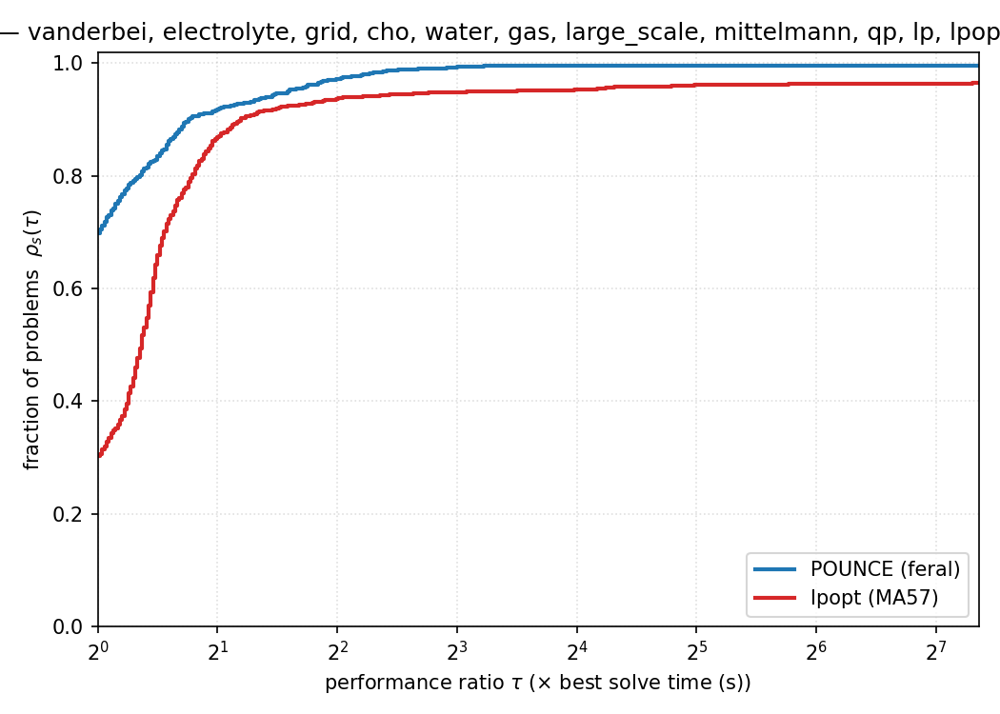
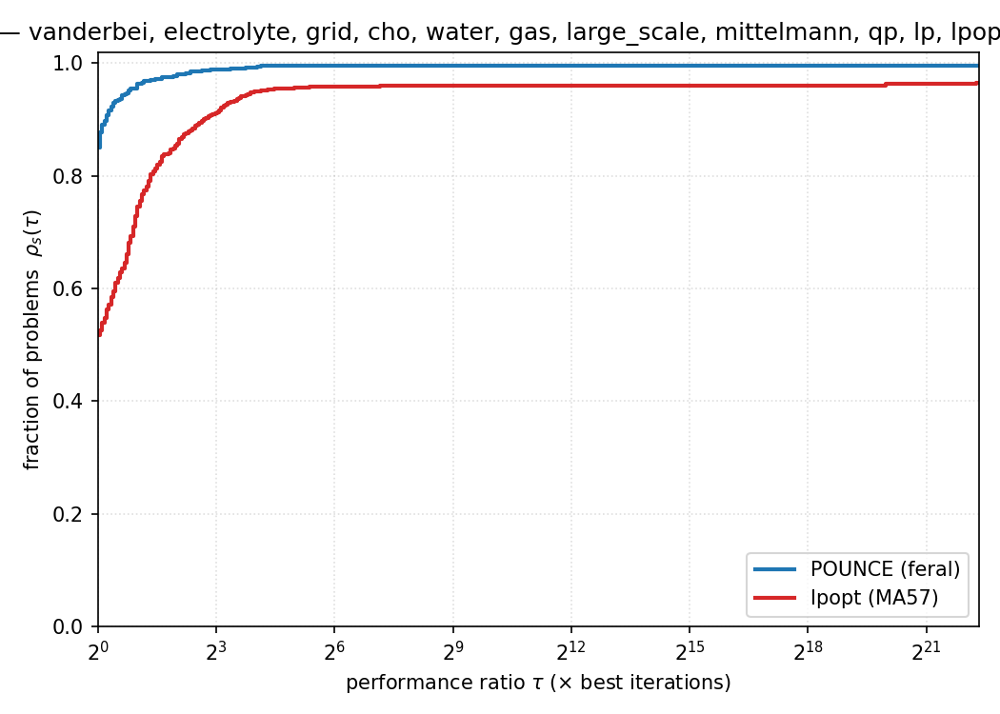
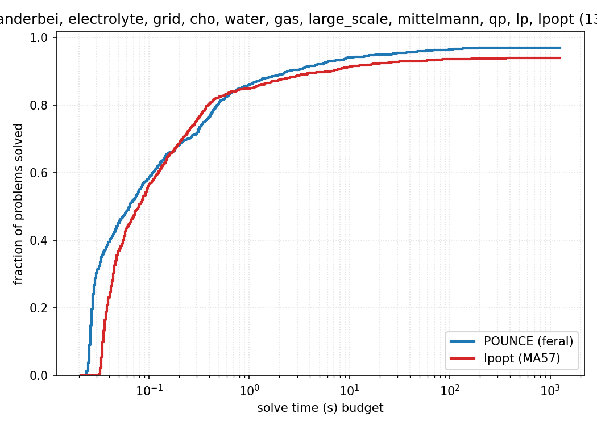

# POUNCE Benchmark Report

Generated: 2026-08-02 00:30:16

## Provenance

| Component | Version / Detail |
|-----------|------------------|
| POUNCE | v0.9.0 (pr443-rebase @ 095e6011-dirty) |
| POUNCE linear solver | feral (default) |
| Ipopt | Ipopt 3.14.20 (Darwin arm64), ASL(20241202) |
| Ipopt linear solver | ma57 (via ref/Ipopt/install-ma57) |
| Platform | Darwin 25.5.0 arm64 |

POUNCE results were produced this run by `make -C benchmarks
<suite>-run` (pounce only). The Ipopt column is a saved reference
(`make -C benchmarks ipopt-reference`), rerun only when explicitly
regenerated — generated 2026-06-11 21:49:49 EDT on Johns-Mac-mini.local (Darwin 25.5.0 arm64), git 659d98a, timelimit 300s. Ipopt solve *times* are
from that reference machine and only comparable to POUNCE when this
report is generated on the same host.

The GAMS solver-link path is exercised separately as a liveness
smoke check (`make -C benchmarks gams-bench`) and is not aggregated here.

> **Threading & timing.** The reference and POUNCE runs are pinned to a
> single compute thread (`OMP_NUM_THREADS`, `OPENBLAS_NUM_THREADS`,
> `VECLIB_MAXIMUM_THREADS`, `RAYON_NUM_THREADS` all = 1) and run
> sequentially so pounce and Ipopt solve times are directly comparable
> on one host.
> POUNCE's dense linear algebra (via `faer`/`rayon`) parallelizes across
> cores, so its *multi-threaded* wall-clock is up to ~2x faster on the
> larger dense problems (e.g. Mittelmann `cont*`/`qcqp*`, QP); the
> single-threaded times reported here are therefore a controlled lower
> bound, not pounce's real-world speed, and should not be compared
> against multi-threaded runs of this report.

## Executive Summary

| Metric | POUNCE | Ipopt |
|--------|--------|-------|
| Optimal (strict) | **1273/1326** (96.0%) | **1237/1326** (93.3%) |
| Acceptable (informational, *not* counted as solved) | 9 | 24 |
| Solved exclusively (strict Optimal) | 46 | 10 |
| Both Optimal | 1227 | |
| Matching objectives (< 0.01%) | 1165/1227 | |

> **Note:** All headline counts use strict Optimal status only. `Acceptable`
> means the iterate met relaxed tolerances but not the requested tolerance —
> per CLAUDE.md's "Honesty in Benchmarks" rule it is reported separately and
> never folded into the pass rate. See the "Acceptable (not Optimal)" and
> "Different Local Minima" sections below.

## Performance Profiles

[Dolan & Moré (2002)](https://doi.org/10.1007/s101070100263) performance profiles pooled over every suite with an Ipopt reference. ρ_s(τ) is the fraction of problems a solver solves within a factor τ of the fastest solver on each problem: the **height at τ=1** is how often it was the quickest, and the **right-hand plateau** is its overall robustness (fraction solved at all). A problem counts as solved only at strict/acceptable success; failures and timeouts are charged infinite cost. Regenerate or slice these with `python3 scripts/perf_profile.py <suite…> [--metric iters] [--mode data]`.

**Performance profile by wall-clock time.** Valid because POUNCE and Ipopt-MA57 were run interleaved on this host (see Provenance).
  
_1285 problems; solvers: pounce, ipopt._

**Performance profile by iteration count** — machine-independent, so it stays comparable across hosts and reruns.
  
_1285 problems; solvers: pounce, ipopt._

**Data profile (absolute-time ECDF).** Fraction of problems solved within a given wall-clock budget, without best-solver normalization — reads directly as “how many by 1 s? by 10 s?”.
  
_1326 problems; solvers: pounce, ipopt._

## Per-Suite Summary

| Suite | Problems | POUNCE Optimal | Ipopt Optimal | POUNCE only | Ipopt only | Both Optimal | Match |
|-------|----------|---------------|--------------|-------------|------------|--------------|-------|
| Vanderbei | 733 | 697 (95.1%) | 683 (93.2%) | 18 | 4 | 679 | 655/679 |
| Electrolyte | 13 | 13 (100.0%) | 13 (100.0%) | 0 | 0 | 13 | 13/13 |
| Grid | 4 | 4 (100.0%) | 4 (100.0%) | 0 | 0 | 4 | 4/4 |
| CHO | 1 | 1 (100.0%) | 1 (100.0%) | 0 | 0 | 1 | 1/1 |
| Water | 6 | 6 (100.0%) | 6 (100.0%) | 0 | 0 | 6 | 2/6 |
| Gas | 4 | 3 (75.0%) | 3 (75.0%) | 0 | 0 | 3 | 3/3 |
| LargeScale | 5 | 5 (100.0%) | 5 (100.0%) | 0 | 0 | 5 | 5/5 |
| Mittelmann | 47 | 41 (87.2%) | 37 (78.7%) | 6 | 2 | 35 | 34/35 |
| QP | 138 | 138 (100.0%) | 133 (96.4%) | 5 | 0 | 133 | 125/133 |
| LP | 371 | 364 (98.1%) | 352 (94.9%) | 16 | 4 | 348 | 323/348 |
| LPopt | 4 | 1 (25.0%) | 0 (0.0%) | 1 | 0 | 0 | 0/1 |

## Vanderbei Reference Cross-Check

Per-problem status from R. Vanderbei's `cute_table.pdf` (`vanderbei/cute_table_status.json`). The meaningful denominator is the **expected-solvable** set — problems with a documented finite optimum — not all 733: the CUTE collection deliberately includes unbounded, infeasible, and no-solver-finishes problems.

| cute_table status | problems | POUNCE solved | meaning |
|---|---|---|---|
| optimum | 684 | 662 | finite reference optimum exists (expected-solvable) |
| hard | 14 | 8 | in table, but SNOPT+NITRO+LOQO all hit time/iter limits |
| infeasible | 3 | 0 | a reference solver declared infeasibility |
| unbounded | 1 | 0 | unbounded below |
| untabulated | 31 | 27 | not in cute_table — no reference datum |

**POUNCE solved 662 / 684 expected-solvable (96.8%).** The hard / infeasible / unbounded / untabulated rows above are excluded from this denominator — a POUNCE failure there is shared with the commercial reference solvers and is not counted as a miss.

**Genuine misses — expected-solvable but POUNCE did not reach Optimal (22):**

> brainpc0 brainpc2 britgas coshfun cresc100 cresc132 cresc50 csfi2 deconvb eigena2 eigenb2 flosp2hh grouping himmelbj kissing nonmsqrt orthrds2 palmer5e polak3 sineali steenbrc steenbrf

**Objective disagreements vs. cute_table reference (23)** — POUNCE converged but to a different value than the agreed reference optimum (possible wrong basin or misread problem):

| Problem | POUNCE obj | reference obj | rel. diff |
|---|---|---|---|
| broydn7d | 3.450050e+02 | 3.823419e+00 | 8.9e+01 |
| liswet9 | 1.963305e+03 | 2.499976e+01 | 7.8e+01 |
| liswet8 | 7.144874e+02 | 2.499977e+01 | 2.8e+01 |
| liswet7 | 4.987922e+02 | 2.499979e+01 | 1.9e+01 |
| palmer1c | 7.932114e+00 | 9.759799e-02 | 7.8e+00 |
| eigenbco | 1.024905e-16 | 9.000000e+00 | 1.0e+00 |
| liswet10 | 4.948391e+01 | 2.499967e+01 | 9.8e-01 |
| orthregd | 1.523900e+03 | 4.245801e+04 | 9.6e-01 |
| orthrgds | 1.523900e+03 | 2.603509e+04 | 9.4e-01 |
| bt4 | -3.704768e+00 | -4.551055e+01 | 9.2e-01 |
| camel6 | -2.154638e-01 | -1.031628e+00 | 7.9e-01 |
| liswet1 | 3.612062e+01 | 2.500304e+01 | 4.4e-01 |
| fletcher | 1.165685e+01 | 1.952537e+01 | 4.0e-01 |
| liswet12 | -3.314381e+03 | -5.026353e+03 | 3.4e-01 |
| discs | 1.444952e+01 | 1.200008e+01 | 2.0e-01 |
| hs044 | -1.300000e+01 | -1.500000e+01 | 1.3e-01 |
| avgasb | -4.483219e+00 | -4.132819e+00 | 8.5e-02 |
| steenbre | 2.851495e+04 | 2.745916e+04 | 3.8e-02 |
| haldmads | 3.299698e-02 | 1.223712e-04 | 3.3e-02 |
| errinros | 4.040449e+01 | 3.990415e+01 | 1.3e-02 |
| lch | -4.287718e+00 | -4.318289e+00 | 7.1e-03 |
| trainh | 1.231200e+01 | 1.236996e+01 | 4.7e-03 |
| twirism1 | -1.003602e+00 | -1.006758e+00 | 3.1e-03 |

## Vanderbei Suite — Performance

On 679 commonly-solved problems:

| Metric | POUNCE | Ipopt |
|--------|--------|-------|
| Median time | 42.0ms | 44.3ms |
| Total time | 327.91s | 234.24s |
| Mean iterations | 47.2 | 46.9 |
| Median iterations | 15 | 16 |

- **Geometric mean speedup**: 0.9x
- **Median speedup**: 1.0x
- POUNCE faster: 327/679 (48%)
- POUNCE 10x+ faster: 1/679
- Ipopt faster: 352/679

## Electrolyte Suite — Performance

On 13 commonly-solved problems:

| Metric | POUNCE | Ipopt |
|--------|--------|-------|
| Median time | 36.3ms | 37.6ms |
| Total time | 477.1ms | 503.3ms |
| Mean iterations | 14.8 | 12.2 |
| Median iterations | 10 | 10 |

- **Geometric mean speedup**: 1.1x
- **Median speedup**: 1.0x
- POUNCE faster: 9/13 (69%)
- POUNCE 10x+ faster: 0/13
- Ipopt faster: 4/13

## Grid Suite — Performance

On 4 commonly-solved problems:

| Metric | POUNCE | Ipopt |
|--------|--------|-------|
| Median time | 40.5ms | 41.9ms |
| Total time | 156.3ms | 157.2ms |
| Mean iterations | 15.5 | 15.5 |
| Median iterations | 17 | 17 |

- **Geometric mean speedup**: 1.0x
- **Median speedup**: 1.1x
- POUNCE faster: 2/4 (50%)
- POUNCE 10x+ faster: 0/4
- Ipopt faster: 2/4

## CHO Suite — Performance

On 1 commonly-solved problems:

| Metric | POUNCE | Ipopt |
|--------|--------|-------|
| Median time | 4.01s | 1.76s |
| Total time | 4.01s | 1.76s |
| Mean iterations | 31.0 | 33.0 |
| Median iterations | 31 | 33 |

- **Geometric mean speedup**: 0.4x
- **Median speedup**: 0.4x
- POUNCE faster: 0/1 (0%)
- POUNCE 10x+ faster: 0/1
- Ipopt faster: 1/1

## Water Suite — Performance

On 6 commonly-solved problems:

| Metric | POUNCE | Ipopt |
|--------|--------|-------|
| Median time | 141.5ms | 122.5ms |
| Total time | 789.0ms | 696.0ms |
| Mean iterations | 193.3 | 205.2 |
| Median iterations | 191 | 209 |

- **Geometric mean speedup**: 0.9x
- **Median speedup**: 0.9x
- POUNCE faster: 1/6 (17%)
- POUNCE 10x+ faster: 0/6
- Ipopt faster: 5/6

## Gas Suite — Performance

On 3 commonly-solved problems:

| Metric | POUNCE | Ipopt |
|--------|--------|-------|
| Median time | 89.7ms | 113.3ms |
| Total time | 318.4ms | 374.0ms |
| Mean iterations | 40.0 | 39.7 |
| Median iterations | 20 | 20 |

- **Geometric mean speedup**: 1.2x
- **Median speedup**: 1.3x
- POUNCE faster: 3/3 (100%)
- POUNCE 10x+ faster: 0/3
- Ipopt faster: 0/3

## LargeScale Suite — Performance

On 5 commonly-solved problems:

| Metric | POUNCE | Ipopt |
|--------|--------|-------|
| Median time | 2.86s | 573.2ms |
| Total time | 13.64s | 9.43s |
| Mean iterations | 309.2 | 305.6 |
| Median iterations | 5 | 2 |

- **Geometric mean speedup**: 0.5x
- **Median speedup**: 0.4x
- POUNCE faster: 2/5 (40%)
- POUNCE 10x+ faster: 0/5
- Ipopt faster: 3/5

## Mittelmann Suite — Performance

On 35 commonly-solved problems:

| Metric | POUNCE | Ipopt |
|--------|--------|-------|
| Median time | 9.64s | 3.57s |
| Total time | 853.70s | 1214.80s |
| Mean iterations | 91.7 | 94.0 |
| Median iterations | 34 | 35 |

- **Geometric mean speedup**: 0.6x
- **Median speedup**: 0.5x
- POUNCE faster: 12/35 (34%)
- POUNCE 10x+ faster: 0/35
- Ipopt faster: 23/35

## QP Suite — Performance

On 133 commonly-solved problems:

| Metric | POUNCE | Ipopt |
|--------|--------|-------|
| Median time | 85.2ms | 92.9ms |
| Total time | 101.55s | 172.97s |
| Mean iterations | 17.9 | 75.6 |
| Median iterations | 17 | 24 |

- **Geometric mean speedup**: 1.1x
- **Median speedup**: 1.1x
- POUNCE faster: 77/133 (58%)
- POUNCE 10x+ faster: 2/133
- Ipopt faster: 56/133

## LP Suite — Performance

On 348 commonly-solved problems:

| Metric | POUNCE | Ipopt |
|--------|--------|-------|
| Median time | 161.9ms | 156.3ms |
| Total time | 295.90s | 419.36s |
| Mean iterations | 24.4 | 107.7 |
| Median iterations | 23 | 56 |

- **Geometric mean speedup**: 1.0x
- **Median speedup**: 0.9x
- POUNCE faster: 151/348 (43%)
- POUNCE 10x+ faster: 10/348
- Ipopt faster: 197/348

## Failure Analysis

### Vanderbei Suite

| Failure Mode | POUNCE | Ipopt |
|-------------|--------|-------|
| Acceptable | 5 | 6 |
| Infeasible_Problem_Detected | 3 | 4 |
| Invalid_Number_Detected | 1 | 3 |
| Maximum_CpuTime_Exceeded | 2 | 8 |
| Maximum_Iterations_Exceeded | 17 | 16 |
| Restoration_Failed | 1 | 3 |
| Search_Direction_Becomes_Too_Small | 0 | 1 |
| Solver_Error | 7 | 2 |
| Unknown_Error | 0 | 7 |

### Gas Suite

| Failure Mode | POUNCE | Ipopt |
|-------------|--------|-------|
| Infeasible_Problem_Detected | 1 | 1 |

### Mittelmann Suite

| Failure Mode | POUNCE | Ipopt |
|-------------|--------|-------|
| Acceptable | 2 | 0 |
| Maximum_CpuTime_Exceeded | 4 | 6 |
| Maximum_Iterations_Exceeded | 0 | 3 |
| Solver_Error | 0 | 1 |

### QP Suite

| Failure Mode | POUNCE | Ipopt |
|-------------|--------|-------|
| Acceptable | 0 | 4 |
| Maximum_CpuTime_Exceeded | 0 | 1 |

### LP Suite

| Failure Mode | POUNCE | Ipopt |
|-------------|--------|-------|
| Acceptable | 2 | 14 |
| Infeasible_Problem_Detected | 2 | 1 |
| Maximum_CpuTime_Exceeded | 1 | 1 |
| Maximum_Iterations_Exceeded | 2 | 1 |
| Restoration_Failed | 0 | 1 |
| Unknown_Error | 0 | 1 |

### LPopt Suite

| Failure Mode | POUNCE | Ipopt |
|-------------|--------|-------|
| Maximum_CpuTime_Exceeded | 2 | 4 |
| Maximum_Iterations_Exceeded | 1 | 0 |

## Regressions (Ipopt Optimal, POUNCE not Optimal)

| Problem | Suite | n | m | POUNCE status | Ipopt obj |
|---------|-------|---|---|--------------|-----------|
| NARX_CFy | Mittelmann | 43973 | 48256 | Acceptable | 8.726796e-03 |
| eigena2 | Vanderbei | 110 | 55 | Acceptable | 8.250000e+01 |
| eigenb2 | Vanderbei | 110 | 55 | Acceptable | 1.600000e+00 |
| gen | LP | 2560 | 769 | Acceptable | -1.097485e-05 |
| gen1 | LP | 2560 | 769 | Acceptable | -1.097485e-05 |
| gen4 | LP | 4297 | 1537 | Maximum_CpuTime_Exceeded | -2.221401e-05 |
| kissing | Vanderbei | 127 | 903 | Acceptable | 8.454426e-01 |
| kleemin8 | LP | 8 | 8 | Maximum_Iterations_Exceeded | -1.000000e+14 |
| orthrds2 | Vanderbei | 203 | 100 | Acceptable | 1.544297e+03 |
| qcqp1000-1nc | Mittelmann | 1000 | 154 | Acceptable | -2.662887e+07 |

## Wins (POUNCE Optimal, Ipopt not Optimal) — 46 problems

| Problem | Suite | n | m | Ipopt status | POUNCE obj |
|---------|-------|---|---|-------------|------------|
| BOYD1 | QP | 93261 | 18 | Acceptable | -6.173522e+07 |
| BOYD2 | QP | 93263 | 186531 | Maximum_CpuTime_Exceeded | 2.125677e+01 |
| QPILOTNO | QP | 2172 | 975 | Acceptable | 4.728587e+06 |
| QRECIPE | QP | 180 | 91 | Acceptable | -2.666160e+02 |
| QSCORPIO | QP | 358 | 388 | Acceptable | 1.880510e+03 |
| aa4 | LP | 7195 | 426 | Acceptable | 2.587761e+04 |
| air05 | LP | 7195 | 426 | Acceptable | 2.587761e+04 |
| bore3d | LP | 315 | 233 | Acceptable | 1.373080e+03 |
| brainpc1 | Vanderbei | 6905 | 6900 | Restoration_Failed | 4.362953e-04 |
| brainpc5 | Vanderbei | 6905 | 6900 | Maximum_CpuTime_Exceeded | 3.752286e-04 |
| brainpc7 | Vanderbei | 6905 | 6900 | Maximum_CpuTime_Exceeded | 3.926834e-04 |
| bt8 | Vanderbei | 5 | 2 | Acceptable | 1.000000e+00 |
| co5 | LP | 7993 | 5715 | Acceptable | 7.144696e+05 |
| complex | LP | 1408 | 1023 | Acceptable | -9.966667e+01 |
| coolhans | Vanderbei | 9 | 0 | Unknown_Error | 0.000000e+00 |
| cq5 | LP | 7530 | 5025 | Acceptable | 4.001338e+05 |
| cvxqp3 | Vanderbei | 10000 | 7500 | Maximum_CpuTime_Exceeded | 1.157111e+08 |
| dallasl | Vanderbei | 906 | 667 | Invalid_Number_Detected | -2.026041e+05 |
| dallasm | Vanderbei | 196 | 151 | Invalid_Number_Detected | -4.819819e+04 |
| dallass | Vanderbei | 46 | 31 | Invalid_Number_Detected | -3.239323e+04 |
| drcav2lq | Vanderbei | 10816 | 816 | Maximum_CpuTime_Exceeded | 1.119702e-03 |
| drcavty2 | Vanderbei | 10816 | 816 | Maximum_CpuTime_Exceeded | 1.119702e-03 |
| eigenc2 | Vanderbei | 462 | 231 | Unknown_Error | 7.718095e+02 |
| finnis | LP | 614 | 497 | Acceptable | 1.727911e+05 |
| flosp2th | Vanderbei | 691 | 0 | Maximum_Iterations_Exceeded | 1.000000e+01 |
| greenbea | LP | 5405 | 2389 | Maximum_Iterations_Exceeded | -7.246479e+07 |
| greenbeb | LP | 5405 | 2389 | Acceptable | -4.302260e+06 |
| henon120 | Mittelmann | 32401 | 241 | Maximum_CpuTime_Exceeded | 1.332947e+02 |
| lane_emden120 | Mittelmann | 57721 | 241 | Maximum_CpuTime_Exceeded | 9.340251e+00 |
| manne | Vanderbei | 1094 | 730 | Acceptable | -9.741479e-01 |
| maros | LP | 1443 | 845 | Acceptable | -5.806374e+04 |
| nql180 | Mittelmann | 129601 | 130080 | Solver_Error | -9.277211e-01 |
| palmer7e | Vanderbei | 8 | 0 | Maximum_Iterations_Exceeded | 1.015390e+01 |
| pilot.ja | LP | 1988 | 940 | Acceptable | -6.113136e+03 |
| pilotnov | LP | 2172 | 975 | Acceptable | -4.497276e+03 |
| polak6 | Vanderbei | 5 | 4 | Unknown_Error | -4.400000e+01 |
| qap15 | LPopt | 22275 | 6330 | Maximum_CpuTime_Exceeded | 1.040994e+03 |
| qcqp1000-2c | Mittelmann | 1000 | 5107 | Maximum_CpuTime_Exceeded | 7.381274e+05 |
| qcqp1500-1c | Mittelmann | 1500 | 10508 | Maximum_CpuTime_Exceeded | 3.882979e+06 |
| qcqp1500-1nc | Mittelmann | 1500 | 10508 | Maximum_CpuTime_Exceeded | 4.778480e+06 |
| recipe | LP | 180 | 91 | Acceptable | -2.666160e+02 |
| scfxm1-2r-27 | LP | 6189 | 4088 | Acceptable | 2.886965e+03 |
| scorpion | LP | 358 | 388 | Acceptable | 1.878125e+03 |
| scrs8-2r-256 | LP | 9765 | 7196 | Maximum_CpuTime_Exceeded | 1.144161e+03 |
| steenbre | Vanderbei | 540 | 126 | Acceptable | 2.851495e+04 |
| steenbrg | Vanderbei | 540 | 126 | Acceptable | 2.747128e+04 |

## Acceptable (not Optimal) — 9 problems

These problems converged within relaxed tolerances but not strict tolerances.

| Problem | Suite | n | m | Ipopt status | POUNCE obj | Ipopt obj |
|---------|-------|---|---|-------------|------------|-----------|
| NARX_CFy | Mittelmann | 43973 | 48256 | Optimal | 8.657970e-03 | 8.726796e-03 |
| csfi2 | Vanderbei | 5 | 4 | Acceptable | 5.501760e+01 | 5.501760e+01 |
| eigena2 | Vanderbei | 110 | 55 | Optimal | 8.250000e+01 | 8.250000e+01 |
| eigenb2 | Vanderbei | 110 | 55 | Optimal | 1.600000e+00 | 1.600000e+00 |
| gen | LP | 2560 | 769 | Optimal | 5.948689e-08 | -1.097485e-05 |
| gen1 | LP | 2560 | 769 | Optimal | 5.948689e-08 | -1.097485e-05 |
| kissing | Vanderbei | 127 | 903 | Optimal | 1.000001e+00 | 8.454426e-01 |
| orthrds2 | Vanderbei | 203 | 100 | Optimal | 1.544296e+03 | 1.544297e+03 |
| qcqp1000-1nc | Mittelmann | 1000 | 154 | Optimal | -2.662887e+07 | -2.662887e+07 |

## POUNCE-Only Suite Details

These suites currently run POUNCE only — no Ipopt-side comparison is captured in their result files. Per-problem timing and iteration counts are shown so users can inspect the whole picture.

### LPopt

| Problem | n | m | Status | Objective | Iters | Time |
|---------|---|---|--------|-----------|-------|------|
| ex10 | 17,680 | 69,608 | Maximum_CpuTime_Exceeded | N/A | 0 | 300.09s |
| irish-electricity | 61,728 | 104,259 | Maximum_Iterations_Exceeded | 2.4544e+06 | 199 | 270.19s |
| qap15 | 22,275 | 6,330 | Optimal | 1.0410e+03 | 22 | 29.27s |
| supportcase10 | 14,630 | 165,684 | Maximum_CpuTime_Exceeded | N/A | 0 | 300.09s |

POUNCE: **1/4 Optimal** in 899.63s total

## Dedicated Convex Solver vs. General NLP (head-to-head)

The same LP / convex-QP `.nl` problems solved twice by the **same**
pounce binary: once routed to the dedicated convex interior-point
solver (`pounce-convex`, via `solver_selection=lp-ipm` / `qp-ipm`) and
once through the general NLP filter-IPM (`solver_selection=nlp`). This
quantifies the speedup the dedicated solver buys on its home turf. It
is a pounce-vs-pounce comparison and is independent of the Ipopt
reference used by the suites above.

### LP — convex vs NLP

| Metric | pounce-convex | pounce-nlp |
|--------|---------------|------------|
| Optimal | 364/371 (98.1%) | 354/371 (95.4%) |
| Solved exclusively | 14 | 4 |
| Both Optimal | 350 | |
| Matching objectives (< 0.01%) | 325/350 | |

On 350 problems solved by both arms:

| Metric | pounce-convex | pounce-nlp |
|--------|---------------|------------|
| Median time | 159.3ms | 230.0ms |
| Total time | 297.54s | 770.31s |
| Mean iterations | 24.5 | 115.1 |
| Median iterations | 23 | 56 |

- **Geometric-mean speedup (convex over nlp)**: 1.4x
- **Median speedup**: 1.2x
- pounce-convex faster: 245/350 (70%)
- pounce-convex 10x+ faster: 13/350
- pounce-nlp faster: 105/350

### QP — convex vs NLP

| Metric | pounce-convex | pounce-nlp |
|--------|---------------|------------|
| Optimal | 137/138 (99.3%) | 112/138 (81.2%) |
| Solved exclusively | 26 | 1 |
| Both Optimal | 111 | |
| Matching objectives (< 0.01%) | 103/111 | |

On 111 problems solved by both arms:

| Metric | pounce-convex | pounce-nlp |
|--------|---------------|------------|
| Median time | 99.9ms | 120.4ms |
| Total time | 100.51s | 203.17s |
| Mean iterations | 17.3 | 69.0 |
| Median iterations | 16 | 21 |

- **Geometric-mean speedup (convex over nlp)**: 1.2x
- **Median speedup**: 1.1x
- pounce-convex faster: 72/111 (65%)
- pounce-convex 10x+ faster: 2/111
- pounce-nlp faster: 39/111

---
*Generated by benchmark_report.py*