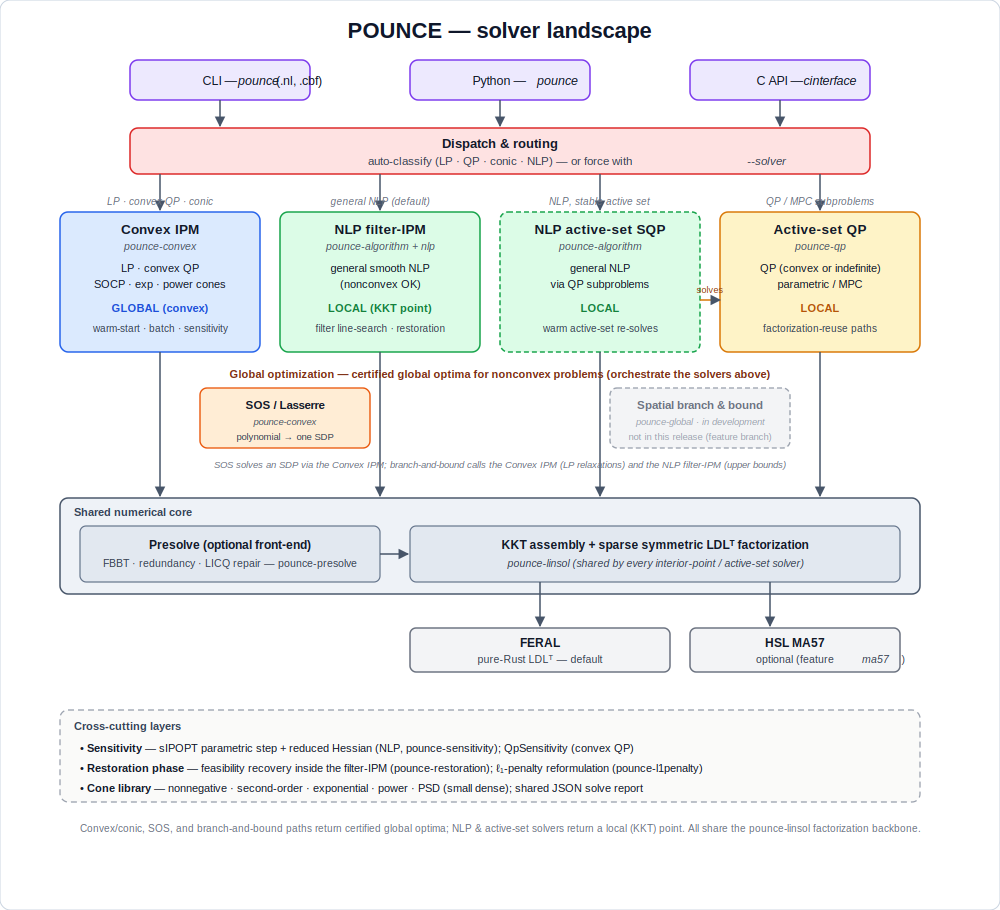

# Choosing a Solver

POUNCE is not a single solver but a small family of them sharing one
numerical backbone. This page is the map: what each solver is, when to
reach for it, and how they fit together.



The one-sentence version: **convex and conic problems are solved to the global
optimum; nonconvex problems are solved locally by default, or to a certified
global optimum via the SOS (polynomial) and spatial branch-and-bound (general)
paths.** Every solver, whatever its flavor, ultimately factorizes a symmetric
KKT system through the shared `pounce-linsol` layer, which in turn drives a
pluggable backend (FERAL by default, HSL MA57 optionally).

## The solvers at a glance

| Solver | Problem class | Optimum | Crate | Entry points |
|---|---|---|---|---|
| **NLP filter-IPM** | general smooth NLP (nonconvex OK) | local (KKT) | `pounce-algorithm` + `pounce-nlp` | CLI default; Python `Problem`/`minimize`; `--solver nlp` |
| **NLP active-set SQP** | general smooth NLP | local | `pounce-algorithm` (subproblems via `pounce-qp`) | `algorithm=active-set-sqp` |
| **Convex IPM (LP/QP)** | LP, convex QP | **global** | `pounce-convex` | `solve_qp_ipm`; `pounce.qp.solve_qp`; `--solver lp-ipm`/`qp-ipm` |
| **Convex IPM (conic)** | SOCP, exponential, power, PSD (small) cones | **global** | `pounce-convex` | `solve_socp_ipm`; `pounce.qp.solve_socp`; `pounce <file>.cbf` |
| **Active-set QP** | QP, convex *or* indefinite | local | `pounce-qp` | `ParametricActiveSetSolver`; `--solver qp-active-set` |
| **SOS / Lasserre** | polynomial (nonconvex) | **global** | `pounce-convex` | `sos_minimize`; `pounce.sos_minimize` |
| **Spatial branch-and-bound** | general factorable nonconvex NLP | **global** | `pounce-global` | `solve_global` |

## When to choose each

### General nonlinear program (the common case) → **NLP filter-IPM**

If your model has nonlinear objective or constraints and you don't know
(or can't assume) convexity, this is the default and the most mature path.
It is POUNCE's port of Ipopt's filter line-search interior-point method:
robust on nonconvex problems, with a feasibility **restoration phase** for
hard starts and exact or limited-memory Hessians. It returns a local
KKT point — for a nonconvex problem there is no global guarantee.

- CLI: `pounce model.nl` (or a built-in problem).
- Python: the cyipopt-style `Problem` class, or the scipy-style
  `minimize` facade.
- Reach for **limited-memory** Hessians (`hessian_approximation=limited-memory`)
  when second derivatives are unavailable or expensive.

### A *sequence* of related NLPs, or a stable active set → **NLP active-set SQP**

Selected with `algorithm=active-set-sqp`. It solves the NLP as a sequence
of quadratic subproblems (handed to `pounce-qp`), which warm-starts
extremely well when the active set is stable across solves — e.g. a
parametric sweep or a control loop. For a single cold solve of a general
NLP, prefer the filter-IPM.

### Linear or convex quadratic program → **Convex IPM (LP/QP)**

If `P ⪰ 0` (or `P = 0` for an LP), use the convex interior-point solver:
it returns the **global** optimum, detects primal/dual infeasibility, and
offers warm-starting, batched and multiple-RHS solving, a build-once /
solve-many `QpFactorization` handle, and post-optimal **sensitivity**
(`QpSensitivity` — the sIPOPT analog). The CLI's `auto` routing classifies
an `.nl` and sends LP/convex-QP problems here automatically.

- Python: `pounce.qp.solve_qp` (and `solve_qp_batch`, `solve_qp_multi_rhs`).

### Second-order, exponential, or power cones → **Convex IPM (conic)**

The same convex solver handles conic programs: second-order cones, the
**exponential** and **power** cones that express geometric programming,
entropy / log-sum-exp, logistic models, and `p`-norm constraints, and the
**positive-semidefinite** cone for small dense SDPs. Also **global**. This
is the path to use when you can cast a nominally-nonconvex problem into a
convex cone — you trade modeling effort for a global guarantee. (The PSD
cone is self-scaled and runs on the symmetric driver; the exp/power cones
run on the non-symmetric HSDE driver, so the two families can't yet be
mixed in one problem.)

- Python: `pounce.qp.solve_socp(..., cones=[("exp", 3), ("pow", 0.5), ...])`.
- CLI: a Conic Benchmark Format file, `pounce model.cbf` (see the CBLIB
  benchmark tier).

### Nonconvex problem, global optimum required → **SOS** or **spatial branch-and-bound**

When the problem is genuinely nonconvex and a *local* optimum is not good
enough, two paths certify the **global** optimum:

- **Polynomial** objective/constraints → **SOS / Lasserre** (`sos_minimize`,
  or `pounce.sos_minimize`). A single semidefinite program certifies the global
  minimum (the largest `γ` with `p − γ` in the Putinar cone), and the global
  minimizers are recovered from the moment matrix — even multiple ones, via a
  facial-reduction step. Best for modest degree and dimension; the SDP grows
  with the relaxation order.
- **General factorable** problems (including `exp`/`ln`/trig), or polynomials
  too large for the SDP → **spatial branch-and-bound** (`pounce-global`,
  `solve_global`). It brackets the optimum between a McCormick relaxation lower
  bound and a local-solve upper bound, subdividing until they meet — returning a
  feasible point and a certified optimality gap. Continuous variables only (no
  MINLP yet).

See [Global Optimization](global-optimization.md) for both in depth.

### Indefinite QP, or a QP inner-solver → **Active-set QP**

`pounce-qp` is a sparse parametric active-set solver that accepts an
**indefinite** Hessian (via inertia control), with two-sided bounds and
factorization-reuse across a homotopy. It is the engine behind the
active-set SQP path, and is the right choice for MPC-style problems or any
setting where you re-solve a slowly-changing QP many times. Use the convex
IPM instead when `P ⪰ 0` and you want a single robust solve with
infeasibility certificates.

## How to override the automatic routing

The CLI classifies each `.nl` problem and picks a solver, but you can force
the choice:

```sh
pounce model.nl --solver auto          # default: classify, then route
pounce model.nl --solver nlp           # filter-IPM (or active-set-sqp via algorithm=)
pounce model.nl --solver lp-ipm        # convex LP interior-point
pounce model.nl --solver qp-ipm        # convex QP interior-point
pounce model.nl --solver qp-active-set # active-set QP
```

See [LP / QP Solver Routing](lp-qp-routing.md) for how classification works
and when it falls back to the more general solver.

## The shared backbone

Every interior-point and active-set solver above assembles a symmetric KKT
system and factorizes it through **`pounce-linsol`**. That trait layer is
backend-agnostic:

- **FERAL** (`pounce-feral`) — a pure-Rust sparse symmetric LDLᵀ
  factorization. The default; no external dependencies.
- **HSL MA57** (`pounce-hsl`) — the well-known Harwell solver via
  `libcoinhsl`, enabled with the `ma57` build feature for large or
  ill-conditioned systems.

Because the backend is pluggable, the same solver code runs on either
without change.

## Cross-cutting layers

These are not solvers you select, but stages and tools the solvers share:

- **Presolve** (`pounce-presolve`) — an optional front-end that tightens
  bounds (feasibility-based bound tightening), removes redundant rows, and
  repairs LICQ degeneracies before the solve.
- **Restoration** (`pounce-restoration`) — the feasibility-recovery phase
  the filter-IPM enters when a step cannot reduce both infeasibility and
  the objective; `pounce-l1penalty` offers an ℓ₁-exact penalty
  reformulation for degenerate / LICQ-violating problems.
- **Sensitivity** — `pounce-sensitivity` gives sIPOPT-style parametric
  steps and reduced Hessians for the NLP; `QpSensitivity` does the same for
  the convex QP. See [Sensitivity Analysis](sensitivity.md).
- **Cone library** (`pounce-convex`) — nonnegative, second-order,
  exponential, power, and (for small dense problems) positive-semidefinite
  cones, so small SDPs solve as a convex class. The PSD cone cannot yet be
  mixed with the exponential/power cones in one problem (they use different
  drivers).
- **Solve report** — every path can emit the machine-readable
  `pounce.solve-report/v1` JSON (status, iterations, residuals, timing).
  See [JSON Solve Report](json-output.md).

## Global vs. local — the honest summary

POUNCE settles a problem globally along three routes, and locally along one:

- **Global by convexity** — LP, convex QP, SOCP, and the exponential / power /
  PSD cone classes. Local *is* global, so a convex or conic reformulation buys
  the guarantee outright.
- **Global by certificate (polynomials)** — the SOS / Lasserre optimizer
  certifies the global minimum of a nonconvex polynomial from a single SDP.
- **Global by branch-and-bound (general nonconvex)** — `pounce-global` does
  deterministic spatial branch-and-bound with McCormick relaxations, FBBT/OBBT
  bound tightening, and local upper bounds, returning a certified optimality
  gap. Continuous variables only for now (no MINLP); see
  [Global Optimization](global-optimization.md).
- **Local for general NLP** — the filter-IPM and SQP paths converge to a KKT
  point, which for a nonconvex problem carries no global guarantee.

Two practical levers for a "global" answer: **modeling** (cast as much as you
can into the convex cone library) and, when that is not possible, the
**global solvers** above — SOS for polynomials, spatial branch-and-bound for
everything factorable.
